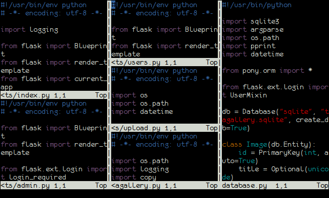

# Dia 15: Splits

mas vamos lá: DICA DE VIM DO DIA!
8:46 AM
Julio Biason
Episódio de hoje: Splits.
8:46 AM
Julio Biason
Para criar splits, existem dois comandos: ":sp" e ":vsp"
8:46 AM
Julio Biason
":sp" cria um split horizontal enquanto que ":vsp" cria um split vertical
8:47 AM
Julio Biason
":sp" e ":vsp" aceitam os mesmo parâmetros do ":e". ou seja, ":sp arquivo +123", ":vsp arquivo +/regex" e ":sp %<.h" funcionam.
8:48 AM
Julio Biason
Não existem limites pros splits: tu pode criar um split vertical dentro de um horizontal dentro de outro horizontal
8:48 AM

Julio Biason
basicamente, tu consegue fazer isso: http://juliobiason.net/wp-content/uploads/2013/11/all.png
8:48 AM
Julio Biason
para navegar entre os splits, é usando Ctrl+W e a direção pra movementação (seta pra direita, esquerda, pra cima e pra baixo)
8:49 AM
Julio Biason
Ctrl+w, Ctrl+w (repetir o Ctrl+w duas vezes) volta pro split anterior.
8:50 AM
Julio Biason
pra aumentar a área de um split horizontal, Ctrl+w + (primeiro Ctrl+w, depois "+";); pra diminuir, Ctrl+w -
8:51 AM
Julio Biason
pra aumentar a área de um split vertical, tu precisa saber qual lado tu quer aumentar: Ctrl+w > aumenta pra direita, Ctrl+w < aumenta pra esquerda
8:52 AM
Julio Biason
Ctrl+w = deixa os splits com o mesmo tamanho (ou o mais igual possível)
8:52 AM
Julio Biason
Pra fechar um split, fechem o arquivo: :q
8:52 AM
Julio Biason
(ou ZZ)
8:52 AM
Julio Biason
(ou :wq)
8:52 AM
Julio Biason
se tiverem vários splits abertos ao mesmo tempo e quiserem salvar todos os arquivos abertos, ":wall"
8:53 AM
Julio Biason
("write all";)
8:53 AM
Julio Biason
Ontem eu falei do "gf" (go to file); pra fazer um "go to file" que abra numa nova aba, usem "Ctrl+w gf"
8:54 AM
Julio Biason
Ah, e se vocês usarem ":sp" ou ":vsp" sem nenhum parâmetro, o VIM abre um split com o mesmo arquivo aberto atualmente.
8:54 AM
Julio Biason
E digitar coisas num split mostra no outro também.
8:54 AM
Julio Biason
(essa parte é interessante quando tu precisa ver alguma coisa no final do arquivo enquanto ajusta alguma coisa no começo do arquivo)
8:55 AM
Delete
Julio Biason
essa foi a dica de vim do dia.