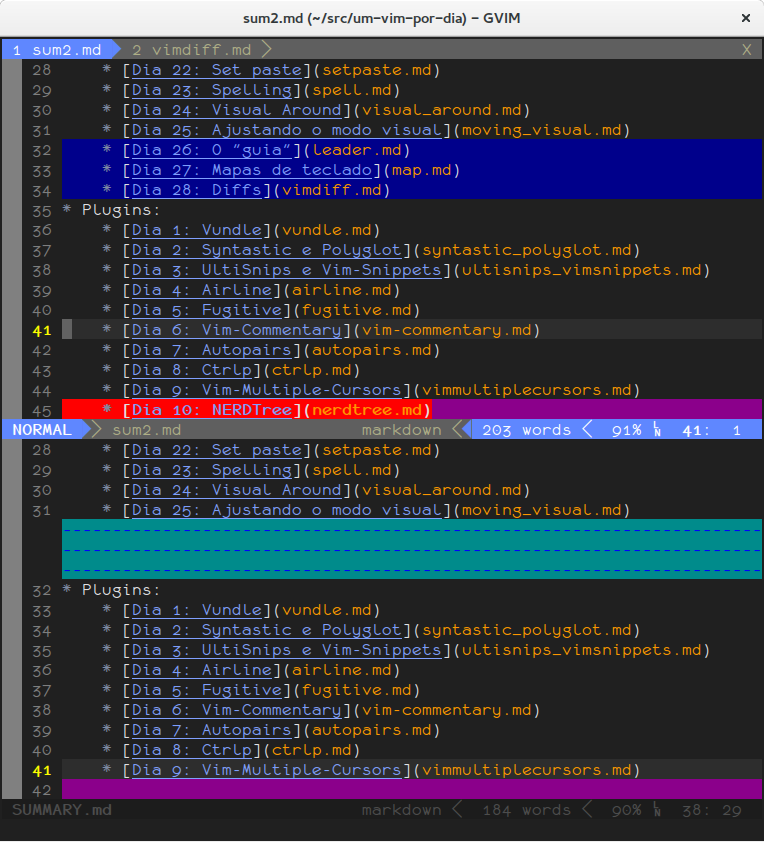

# Dia 28: Diffs

"Diffs" mostram a diferença entre dois arquivos. VIM possui um modo específico
para diffs, mostrando exatamente onde estão as diferenças.

Para abriar um diff, você deve ter um dos arquivos já aberto; a seguir, o
segundo arquivo deve ser aberto com `:diffsplit`, seguido do nome do arquivo.
Será criado um split mostrando a diferença entre os dois.

Linhas que existem em um arquivo e não no outro serão marcadas na que existem
e mostradas como uma sequência de hífens ("-") no outro; linhas alteradas
serão mostradas com um fundo diferente e as diferenças em vermelho.

No exemplo, as linhas dos dias 26, 27 e 28 existem apenas no arquivo de cima e
não no arquivo de baixo. A linha com NERDTree existe nos dois arquivos, mas no
arquivo de baixo, a linha está em branco e por isso todo o conteúdo é mostrado
em vermelho; se a alteração fosse apenas o nome "NERDTree" apenas este pedaço
estaria com o fundo vermelho.

(Cores podem ser um pouco diferente, dependendo do tema escolhido, embora
poucos temas realmente alterem as cores do diff.)

Para abrir um split na vertical ao invés da horizontal, ao invés de
simplesmente `:diffsplit`, deve ser usado `:vert diffsplit`.

Uma vez em modo de diff, existem dois atalhos que podem ser usados para passar
as diferenças de um arquivo para o outro: `[d][p]` ("diff put") irá pegar a
alteração no buffer atual e enviar para o outro buffer; `[d][g]` ("diff get")
irá pegar a alteração do outro buffer e passar para o buffer atual.
